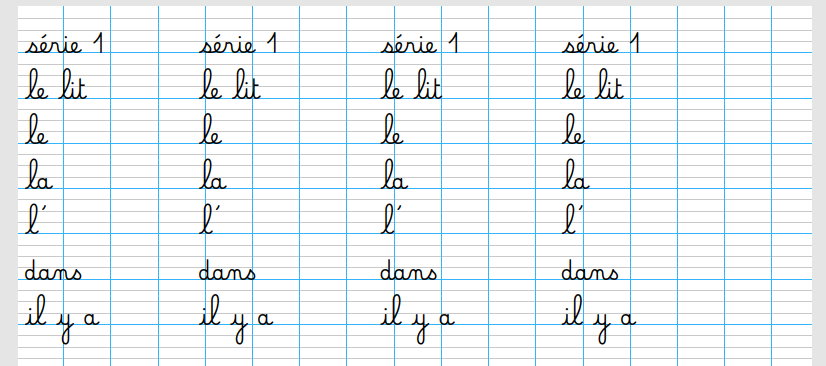

# ecole-seyes_mots

Ce projet permet la génération de pages avec des lignes seyès et l'aide de polices cursives dans un navigateur
Nécessite l'installation d'une police d'écriture payante (non fourni ici) : https://legestedecriture.fr/produit/cursive-dumont/

## Captures d'écrans



## Code local

Le projet nécessite NodeJS (>16)

Cloner le projet en local

```bash
  git clone https://link-to-project
```
Installer les dépendances

```bash
  npm install
```

Démarrer le serveur web avec rafraîchissement automatique

```bash
  npm run start:local
```
